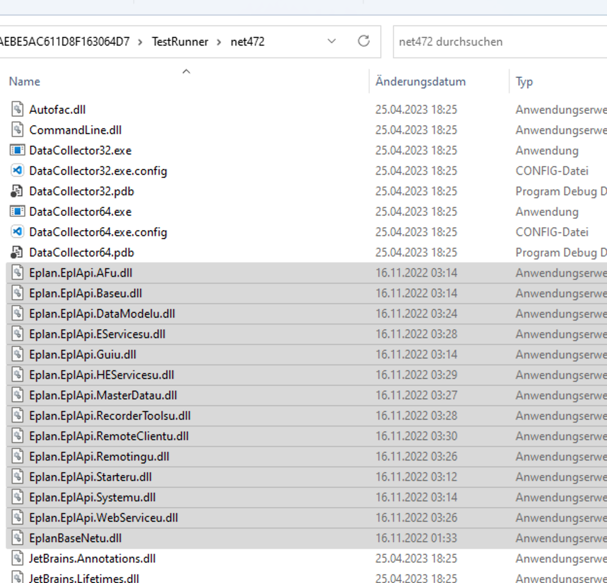

# EplanTestExample
Example to use NUnit tests with EPLAN API classes


## Setup

For nUnit we have to give the TestRunner the EPLAN DLLs. No workaround found:
```C:\Program Files\JetBrains\JetBrains Rider 2023.1\lib\ReSharperHost\TestRunner\net472```


